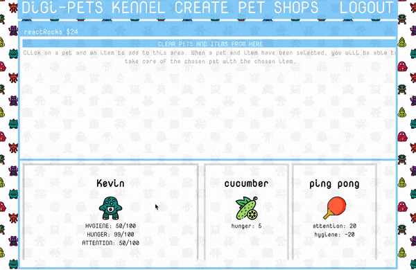

## Digi - Pets

Digi - Pets is a casual game web game, where a player can create pets and care for them after purchasing items at various shops.

This is the frontend repo for Digi - Pets, the backend can be found at the following address:

https://github.com/MichelleNguy/digi-pet-backend

### Motivation

Neopets nostgolia.

### Demo




#### Video below:

[](https://www.youtube.com/watch?v=UNI6m8VSLF8 "Digi-pets demo")

### Screenshots


### Installation
1. Clone the repo and CD inside the directory
2. ``npm install``
3. ```npm start```

Make sure to visit the repo for the backend and follow those instructions!

### Tech/Frameworks

+ React
+ React-Redux
+ React-Router
+ Redux-Thunk
+ React-motions
+ UUID
+ Vanilla CSS

### License

MIT © Michelle Nguyen
